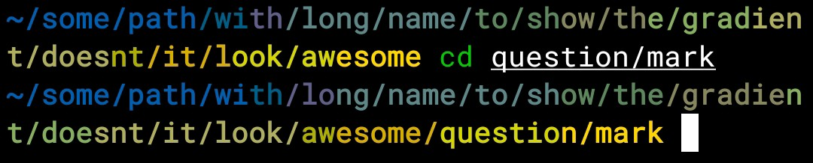

# Blazesh

It is a custom shell prompt theme made in Rust


It was created to be minimal, compact, beautiful, smart (compared to a potato), and just a fun experiment

## Why

There might be a few "why" questions related to this project

1. **Why Rust?** Because it is easier. I know, it is a complied language, but it is so much easier to implement complex features than in shell scripts, it doesn't have to run a thousand commands to do something simple. And just because why not
2. **Why Blazesh?** As a reference to the fact that everything written in Rust is blazingly fast. It's not the primary goal, if you want the fastest experiene, just run `PS1='$ '` in your shell. I just like how Blazesh sounds
3. **Why (in general)?** To create something that would be the closest to my ideal prompt. Also to be a fun project

## Installation

You can install it using:

```sh
cargo install --git https://github.com/rdsq/blazesh
```

And then add one of these to your shell config file:

### Bash `~/.bashrc`

```sh
eval "$(blazesh setup bash)"
```

### Zsh `~/.zshrc`

```sh
eval "$(blazesh setup zsh)"
```

### Bash or Zsh autodetect

```sh
eval "$(blazesh setup detect)"
```

### Fish `~/.config/fish/config.fish`

```fish
blazesh setup fish | source
```

## Features

The prompt shows a clean path, if it is too long it is cut

It also shows the error exit codes, some of them with special messages *(doesn't work on Bash)*

And the git panel, yes it kind of takes time to load, but it is helpful

- `+` represents the uncommitted changes
- `↑` represents unpushed changes
- `↓` represents unpulled changes

And it also shows the number of background jobs if it is not `0` like this:


## Configuration

Here is how you can configure Blazesh with environment variables:

### Git mode

You can configure how it handles git by changing the `BLAZESH_GIT_MODE` environment variable. **Possible values:**

- `unoptimized` - check git status every time, even if it is not a git repository
- `optimized` (default) - check git status only if the current directory or one of its parents is a git repository. **Best for functionality**
- `optimized-cwd` - like `optimized`, but checks only the current directory, doesn't check its parents
- `static` - just show `[git]` if the current directory or one of its parents is a git repository. Does not check any status or anything. **Best for performance balance**
- `static-cwd` - like `static`, but checks only the current directory
- `disabled` - completely disable git integration

*And yes, you can use non 🦅🦅🦅🦅🦅🦅 spelling*

### Colors

You can set the color of the path in the prompt by editing `BLAZESH_ACCENT_COLOR`. You can set it to any number 0-7 and 9 representing the ANSI color codes, and also any RGB HEX value. You can also set it to a sequence of colors, and it will show them as repeating colors. **Examples:**
    - `5` - magenta
    - `9` - default color (usually white or black)
    - `4 3` - 🇺🇦
    - `4 4 4 4 3 3 3 3` - same as the previous one, but more readable
    - `0 1 2 3 4 5 6 7` - full ANSI rainbow
    - `FF0000 FF7F00 FFFF00 00FF00 00FFFF 0000FF 8B00FF` - actual rainbow 🌈

**But** it also has the second mode: **gradient**

You can set a gradient between any two RGB values by following the `gradient [color1] [color2]` syntax

For example, set the `BLAZESH_ACCENT_COLOR` environment variable to `gradient 0057B7 FFD700` to see the gradient between the official 🇺🇦 colors



And the default color is a gradient too! It is `gradient FF9900 FFFF00`

### Path

Use `BLAZESH_PATH_DEPTH` to edit how many directories to show before replasimg them with `...`. Any number from 0 to 255. **Default: 2**

**Examples with values and how it displays the path**:

- `0` - `...`
- `1` - `.../src`
- `2` *(and higher)* - `~/blazesh/src`

### Exit codes format

You can change how exit codes will be shown in the prompt by editing `BLAZESH_EXIT_CODE_FORMAT`. Possible values:

- `code`: just the code, no message, if you like it serious. Example: `[130]`
- `message`: just show the message if available, good for being compact. Example: `[SIGINT]`
- `both` *(default)*: show both the code and the message. Example: `[130/SIGINT]`

### Path shorthands

By default, it shortens `$HOME` as `~`, but you can define your own custom shorthands with `BLAZESH_PATH_SHORTHANDS` in `path:shorthand` format. Just don't forget to add `$HOME:~` first

For example, `$HOME:~;/root:r~` would show paths as:

- `$HOME/something`: `~/something`
- `/root/something`: `r~/something`

## Example configurations

### Insanity

*You have the fredom to make your command prompt look insane if you are*


```sh
export BLAZESH_ACCENT_COLOR='0 1 2 3 4 5 6 7'
export BLAZESH_PATH_DEPTH=255
```

### Random color every session

You can put this to your `.bashrc`/`.zshrc` or wherever you store your configs and get a new accent color every time you open the shell

```sh
ansi_colors=(0 1 2 3 4 5 6 7)
export BLAZESH_ACCENT_COLOR=$(printf "%s\n" "${ansi_colors[@]}" | shuf -n 1)
```

Or random RGB color:

```sh
export BLAZESH_ACCENT_COLOR="$(printf '#%06X\n' $((RANDOM * RANDOM % 16777216)))"
```

Or random gradient:

```sh
# Generate 12 random hex cluster
random_hex=$(xxd -p -l 6 /dev/urandom)

# Split in two
color1="#${random_hex:0:6}"
color2="#${random_hex:6:6}"

export BLAZESH_ACCENT_COLOR="gradient $color1 $color2"
```

And you can do that with so much more, like days of the week, hours, whatever you wish!

## Problems

The most obvious one: **synchronous git**. Unfortunately I am not smart enough to figure out how to do that asynchronously, so... Well it's not *that* bad. Even on my 🥔 it runs fast enough to be usable daily. But I mean it's still better than nothing. Fish, for example, does it synchronously too, but with less features. At least here it can be disabled or customized

Not so critical one, but also worth mentioning: **exit codes** don't show up in **Bash**. As far as I can tell, this issue cannot be fixed, it's just how Bash works

## Fish shell

Yeah it also supports Fish, I don't know why I did this, but it was easy. I am too lazy to rewrite all the documentation, *if you count it as such*, to include Fish, since it is kind of different from other shells, just figure it out on your own. The file is `blazesh.fish`. Just source it in your `~/.config/fish/config.fish` or, again, wherever you store your configs
