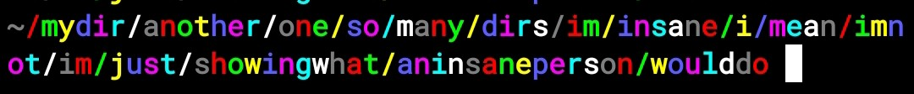

# Blazesh

It is a custom prompt theme for Zsh made in Rust


It was created to be minimal, compact, beautiful, smart (compared to a potato), and just a fun experiment

## Installation

Simply clone it somewhere using `git`

```sh
git clone https://github.com/rdsq/blazesh
```

Then add this line to `.zshrc`

```zsh
# Replace `~/blazesh` with your path
source ~/blazesh/prompt.zsh
```

And don't forget to compile it using `cargo build --release`. So the full script to install it:

```sh
git clone https://github.com/rdsq/blazesh ~/blazesh
echo "source ~/blazesh/prompt.zsh" >> ~/.zshrc
cd ~/blazesh
cargo build --release
cd -
```

## Features

The prompt shows a clean path, if it is too long it is cut

It also shows the error exit codes, some of them with special messages

And the git panel, yes it kind of takes time to load, but it is helpful

- `+` represents the uncommitted changes
- `↑` represents unpushed changes
- `↓` represents unpulled changes

And it also shows the number of background jobs if it is not `0` like this:


## Configuration

Here is how you can configure Blazesh with environment variables:

- `BLAZESH_GIT_MODE` - configure how it handles git. Possible values:
    - `unoptimized` - check git status every time, even if it is not a git repository
    - `optimized` (default) - check git status only if the current directory or one of its parents is a git repository. **Best for functionality**
    - `optimized-cwd` - like `optimized`, but checks only the current directory, doesn't check its parents
    - `static` - just show `[git]` if the current directory or one of its parents is a git repository. Does not check any status or anything. **Best for performance balance**
    - `static-cwd` - like `static`, but checks only the current directory
    - `disabled` - completely disable git integration

- `BLAZESH_ACCENT_COLOR` - set the color of the path in the prompt. You can set it to any number 0-7 and 9 representing the ANSI color codes. The default is `6` (cyan). You can also set it to a sequence of colors, and it will show them as repeating colors. **Examples:**
    - `5` - magenta
    - `9` - default color (usually white or black)
    - `4 3` - 🇺🇦
    - `4 4 4 4 3 3 3 3` - same as the previous one, but more readable
    - `0 1 2 3 4 5 6 7` - full ANSI rainbow

- `BLAZESH_PATH_DEPTH` - how many directories to show before replasimg them with `...`. Any number from 0 to 255. **Default: 2**

## Insanity

*You have the fredom to make your command prompt look insane if you are*



```sh
export BLAZESH_ACCENT_COLOR='0 1 2 3 4 5 6 7'
export BLAZESH_PATH_DEPTH=255
```
